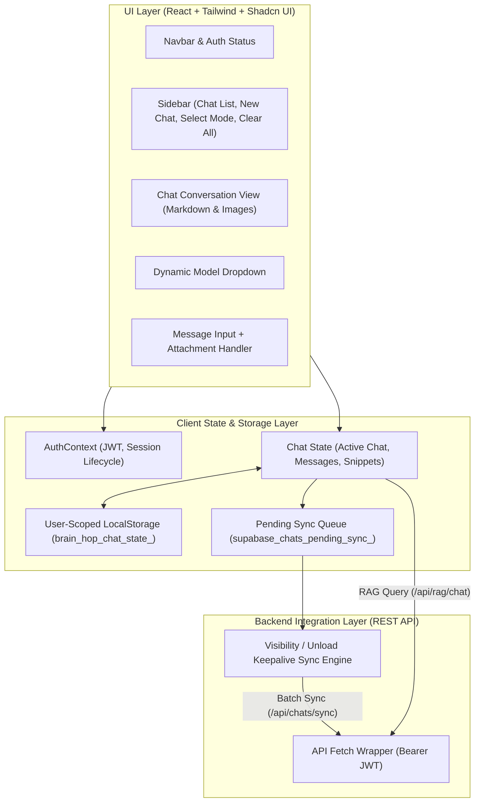

# Brain Hop Frontend - Architecture & System Design Document

## 1. Overview

**Brain Hop Frontend** is a modern Single Page Application (SPA) built with React 18, TypeScript, Vite, Tailwind CSS, and Shadcn UI. It offers dynamic model switching, conversational chat merging, persistent contextual memory, and robust multi-account isolation.

---

## 2. Architecture & Data Flow



---

## 3. Core Architectural Principles

### 3.1 Multi-Account Session Isolation
To prevent cross-account data leakage across shared devices:
1. **User-Scoped Storage Keys**:
   - `brain_hop_chat_state_<userId>`: Stores active chat history and current view for that specific user.
   - `supabase_chats_pending_sync_<userId>`: Stores unsynced messages and chat mutations for that user.
   - `profile_page_prefs_<userId>`: Stores user preferences and profile form data.
2. **Account Switch Detection**:
   - `lastLoadedUserIdRef` in `Chat.tsx` detects changes in `user.id`. When a user switches accounts or logs in, the previous in-memory state is completely cleared, and only the active user's cached and remote chats are hydrated.
3. **Session Purge on Logout**:
   - On `logout()`, all legacy/unscoped cache keys are removed, and local auth state resets immediately.

### 3.2 Dual-Tier Persistence & Sync Engine
* **Optimistic Local Response**: Messages and new conversations are stored instantly in `localStorage` for zero-latency UI feedback.
* **Background Queue**: Changes are queued in `supabase_chats_pending_sync_<userId>`.
* **Sync Triggers**:
  1. **User Action**: On sending messages and creating/merging chats.
  2. **Page Visibility**: Syncs automatically when switching tabs (`document.visibilityState === 'hidden'`).
  3. **Page Unload**: Uses `fetch(..., { keepalive: true })` to guarantee delivery even when the user closes the browser window.

### 3.3 Chat Deletion & Memory Purge
* **Granular Deletion**:
  - Clicking the **Trash icon** next to any conversation triggers a confirmation prompt.
  - Sends `DELETE /api/chats/:chatId` to the backend.
  - Removes the record from `public.chats`, memory chunks from `public.chat_memory_chunks`, and images from Supabase Storage.
  - Removes the chat from local state and the pending sync queue.
* **Bulk Deletion ("Clear all chats")**:
  - Sends `DELETE /api/chats` to wipe all conversations and embeddings associated with the user account.

---

## 4. Component Structure

```
src/
├── components/
│   ├── ui/                 # Shadcn atomic components (Button, Dialog, Select, etc.)
│   ├── landing/            # Landing page sections & feature highlights
│   ├── FloatingTextMenu.tsx # Highlight-to-snippet popover
│   ├── Navbar.tsx          # Global navigation, theme toggle, profile/logout
│   └── ThemeToggle.tsx     # Light/Dark mode switcher
├── context/
│   └── AuthContext.tsx     # Supabase OAuth and JWT session management
├── data/
│   └── models.ts           # Model definitions, active free models, and metadata
├── hooks/
│   └── use-toast.ts        # Toast notifications
├── pages/
│   ├── Chat.tsx            # Main RAG chat interface, sidebar, and message stream
│   ├── Profile.tsx         # User settings, preferences, and account management
│   ├── Models.tsx          # Model catalog and selection view
│   ├── Login.tsx           # Authentication page (Google OAuth + Email)
│   └── Landing.tsx         # Landing page
└── utils/
    ├── chatSync.ts         # User-scoped sync utilities & Supabase fetchers
    └── supabase.ts         # Supabase client initializer
```

---

## 5. Development & Environment Configuration

### Setup `.env`
```properties
VITE_API_BASE_URL=http://localhost:3001
VITE_SUPABASE_URL=https://<your-project>.supabase.co
VITE_SUPABASE_ANON_KEY=<your-anon-key>
```

### Commands
```bash
# Install dependencies
npm install

# Run dev server (http://localhost:5173 or http://localhost:8080)
npm run dev

# Type check
npx tsc --noEmit

# Production build
npm run build
```
